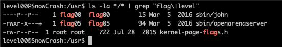
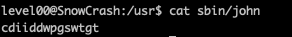
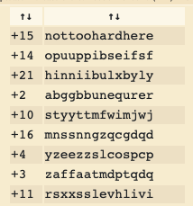
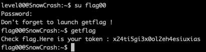

<h2>Level 00</h2>

"su" command is used to switch to another user

Since the project hint that we should do "su flag00" and insert the password to pass this level,
lets investigate on the "usr" folder

First from our current location after we are connected, we must go to the root directory where everything is located.
```console
cd /
```

Next nagivate to "usr" folder
```console
cd usr
```

Now we are in the /usr directory, lets try to look at all the information of the file
```console
ls -la */*
```

It is proven to be very counter intuative as there is too much file to look at
So lets try to tweet the command a little bit
Since we are trying to change to user flag00 or maybe level00 we can try to use the "grep" command help us filter the info
```console
ls -la */* | grep "flag\|level"
```

And there we found our first clue!



Lets look at what is inside the file
```console
cat sbin/john
```

The result is very SUS, looks like its some secret code or something :thinking:



This secret code looks like a ciphered text, let try with https://www.dcode.fr/caesar-cipher and use brute force attack on it :innocent:



There is many possible result, the one that is very readable is "nottoohardhere"
Lets try it!



Et voila! Its a success! not too hard indeed   :partying_face: :tada: :tada: :tada:
