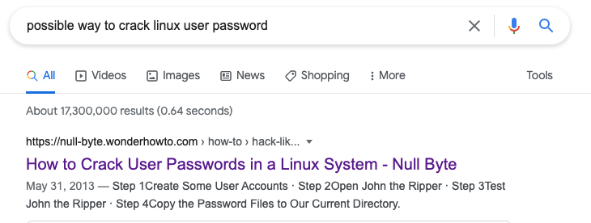
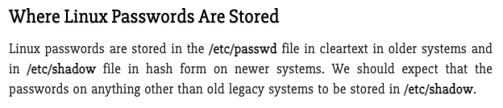
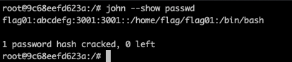

<h2>Level 01</h2>

Repeated the same step as level 00, but there is no new clue on where the password for flag01 could be

Time to ask the mighty google!



The first link looks promising, it mentioned about the following



This link also mentioned that there is a password cracker called `John the Ripper` that could be used to crack the `/etc/passwd` or `/etc/shadow`

Lets try and download the `/etc/passwd` from the snow_crash VM into our local machine
```console
scp -P 4242 level01@<snow_crash_ip>:/etc/passwd .
```

Since the project PDF mentioned that `If you plan to use a specific external software, you must set up a specific environment (VM, docker, Vagrant)`
Lets get a docker 🐳 to run the JOHN :sunglasses:

Guide to install docker and run ubuntu image for mac:

Install Docker Desktop for Mac

Next run this command on terminal
```console
docker run -it --name ubuntu ubuntu:xenial bash
```

Inside the docker ubuntu
```console
apt update && apt-get install john
```

Next to copy the `passwd` that we copied from snow_crash VM into our docker ubuntu

First we need to get the `CONTAINER ID` from docker with this command
```console
docker ps
```

Next we can copy the file into docker with this command
```console
docker cp <src-path> <container_id>:<dest-path> 
```

Finally use `John the Ripper` to crack the `passwd` that we have just copied into the docker
```console
john --show <file-path>
```



And at last, we have the password for flag01 which is `abcdefg`!    :partying_face: :tada: :tada: :tada:
