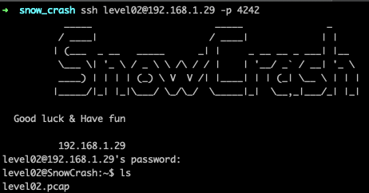
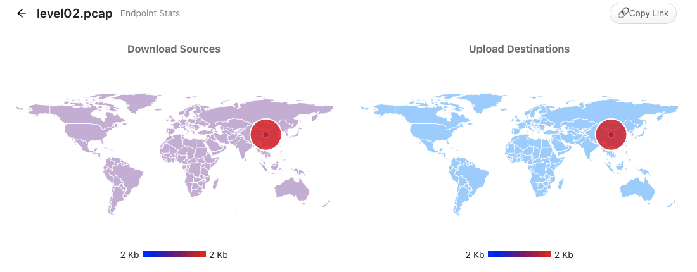
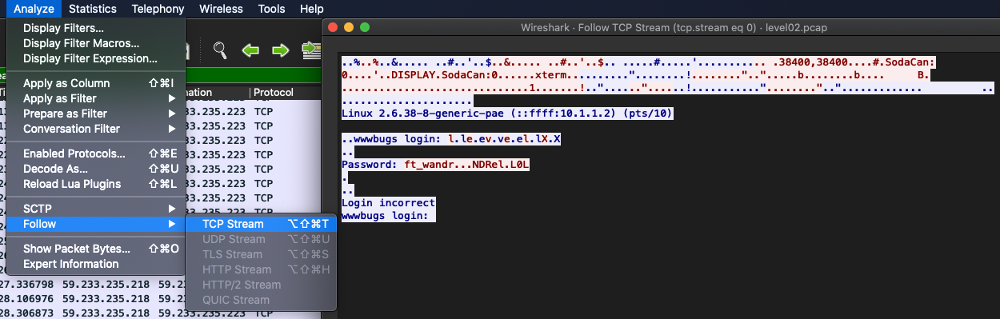
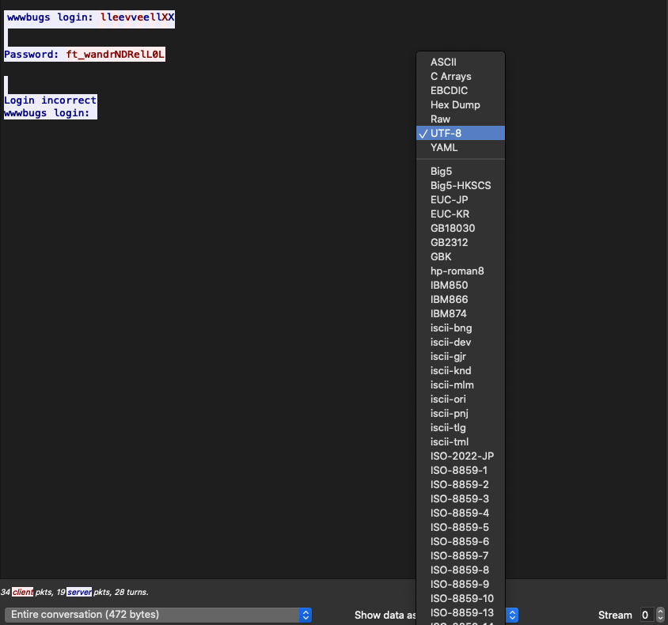
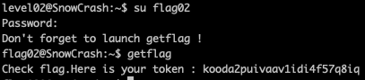

<h2>Level 02</h2>

As soon as we login into level 02 we have something different this time, there is actually a file in our directory



What is this `level02.pcap` file? If we use cat ( command line cat, not an actual cat🐈 ) to read it, it is very unreadable

Lets download it to our local machine using `scp` like the previous level
```console
scp -P 4242 level01@<snow_crash_ip>:/home/user/level02/level02.pcap .
```

According to Mr google and Sir Wikipedia, `pcap is Packet Capture API` which capture live network packet data

How could this file contain any clue? :thinking:

(Easter Egg)
It seems that this packet was from china :thinking:



It seems that we could use a program called `wireshark (https://www.wireshark.org/#download)` to analyze this packet

After we download the wireshark, we couldn't open the file because of the permissions issue, let's fix it
```console
chmod 777 level02.pcap 
```

Now we can open the file and we will have a list of the communication that happened in this packet

We can go to Analyze -> Follow -> TCP stream



Finally we have a more human readable text and we can see that `Password: ft_wandr...NDRel.L0L`

Unfortunately that password is incorrect 😢😢😢

Lets try to show the data in a different format such as `UTF-8`



Now we have a different view of the password, which is `ft_wandrNDRelL0L` but this password is not working as well 😢😢😢

**WAIT A MINUTE!!**

If we try to type `ft_wandrNDRelL0L` by ourselves, the password will not be accepted,

But if we copy the text directly from wireshark, the password is accepted!! Why is this happening?

Turn out if we copy the text directly, we copied the special character as well `ft_wandrNDRelL0L`

What are those special character and what did they do to our text string?

If we go back to wireshark and show the data as `Hex Dump`, we could see the Hex code of those character
> 66 74 5f 77 61 6e 64 72 7f 7f 7f 4e 44 52 65 6c 7f 4c 30 4c 0d
> 
> f  t  _  w  a  n  d  r  .  .  .  N  D  R  e  l  .  L  0  L  .

According to `Man ASCII`, hex code `7f` is the control character which represent `DEL` and `0d` is just `\r`

So if we apply the `DEL` operation manually, we could trim the password and the final password will be
> ft_waNDReL0L

Finally, this is the correct password! What a long process 😢😢😢

