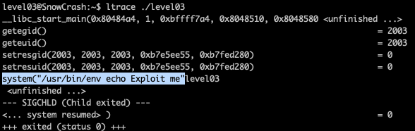
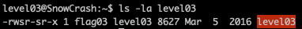
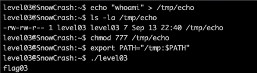
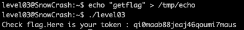

<h2>Level 03</h2>

This time we are welcomed with a single file called `level03`

We don't have much clue on this file unlike the previous level

After some search in google, here is a good link for read
`https://opensource.com/article/20/4/linux-binary-analysis`

We will first be suggested to use the command `file` to know which type of file this is

Now we could see that the file is `ELF 32-bit LSB executable` and with another quick search, it seems that we can run this file like a `C binary executable`, so lets go and run this file to see what it does

The file just print `Exploit me` and nothing else, lets try the other command that where suggested by the previous link to anaylize further

<h3>Exploit No.1 env PATH</h3>

---

`ltrace` is a good command to analyze an executable, it gives us the information on the function that is executed, including the parameters as well as the return value of the function.

From the analysis made by ltrace, we can see that the "Exploit me" was a result from the `echo` command using a system call.

This executable is calling the echo base on the env PATH `system("/usr/bin/env echo)`

`/usr/bin/env` contained the PATH information on where the executable of `echo` is located, we can use `printenv` command or write `/usr/bin/env` directly on the terminal to read the content.

This means that we could potentially write a `fake echo` and change the env PATH, and this `level03` executable will be calling our echo instead of the real one.

<h3>Exploit No.2 's' file permision</h3>

---

With `ls -la` we can see that the `level03` executable has the permission of `-rwsr-sr-x`

The `s` in the permission, means that this executable will be run as the file owner itself, and in this case, the executable will be run as the user `flag03`

Luckily `flag03` are the user that are able to the get the token from `getflag` command. So combine with the previous explot, we could reach our final solution

<h3>Final Solution</h3>

---

First we need to create a `fake echo`, unfortunately as user `level03` our location to create a new file is very limited, but luckily we are freely to create anything in the `/tmp/`

Now we will create our `fake echo` which will run `whoami` to test if our solution is really working.

After the `fake echo` is created, the default file permission is `-rw-rw-r--` which does not allow anyone to execute it, fix this with `Chmod 777`

Lastly we will change the env PATH, so the `level03` echo will be using our `fake echo` instead with `export PATH="/tmp:$PATH"`

Now lets test the `level03` to see if our hypothesis is correct

Voila!! The result of `whoami` shows that we are user `flag03`!!

Which means if we change the `fake echo` into calling the `getflag` command, we could potentially get the token straight away!

Lets try this!

Finally we have succeded in exploting the file and get the token as our reward!! :partying_face: :tada: :tada: :tada:
