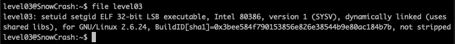
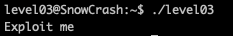

<h2>Level 02</h2>

This time we are welcomed with a single file called `level03`

We don't have much clue on this file unlike the previous level, so if we do a quick search on google `cmd line check the type of file`

We will be suggested to use the command `file` to know which that type of file is this

Now we could see that the file is `ELF 32-bit LSB executable` and with another quick search, if seems that we can run this file like a `C binary executable`, so lets go and run this file to see what it does

