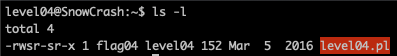

<h2>Level 04</h2>

Upon arriving on `level04` lets see what we have this time



It seems that we have a `perl script` that have the same permission as the previous level, which means we could run this as `flag04`

Lets inspect the script with a simple `cat` command


Base on the script we can see the following
```console
# localhost:4747
use CGI qw{param};
```

This means that this script is using GCI (Common Gateway Interface) which allow us to execute it via web requests and the address is the `localhost:4747`

```console
print "Content-type: text/html\n\n";
```
Nothing interesting here

```console
sub x { 
  $y = $_[0];
  print \`echo $y 2>&1\`;
} 
x(param("x"));
```

This is the core function of the script, the first line is defining a subroutine (like the function or method in other programming language)

This subroutine is executed with `x(param("x"))`, the 1st `x` is the name of the subroutine and the `param("x")` is the parameters that was send with the `url`

Inside the subroutine, we can see that `$y = $_[0]` which means that is taking the 1st paramaters given, in this case `$y = param("x")`

Next line is where our exploit will be, it print `echo $y` which means that if the `param("x")` is a executable command, the echo will execute that command.

We could use `curl` command to call the `localhost:4747` so the script will get executed, at the same time we can pass the `x=$(getflag)` or `` x=`getflag` `` so that the echo will execute the getflag for us, via the `flag04` user


And here we go! The sweet token is ours!! :partying_face: :tada: :tada: :tada:
