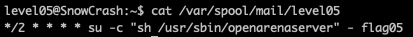
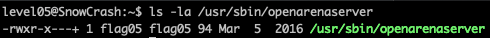
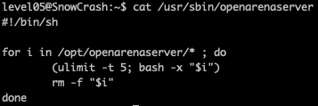

<h2>Level 05</h2>

This time we were great by a message `You have new mail` from the shell when we login to `level05`

Normally mail file is located at either `/var/spool/mail/$USER` or `/var/mail/$USER`

In this snowcrash, `/var/spool/mail/$USER` is linked to `/var/mail/$USER` so we can do a `cat` command to read either of those file

From the result, we could see that is the a cron job schedule, cron job is a scheduler that will automatically run a task or script that is defined in the line

`*/2` at the begining of the line means that this job will be run every 2mins, and the rest of the `*` means that it will run every hour, day, month and weekday.

Basically this means that this cron job will run the script every 2mins

Next we could see that the cron job is running the following `su -c "sh /usr/sbin/openarenaserver" - flag05`

This means that it will run `sh /usr/sbin/openarenaserver` as user `flag05`

Lets check that executable!

The owner of the file is `fla05`, but this time without the `s` permission, this won't be a problem as the cron job will be executing this as `flag05` anyway, so potentially we can hijack this file as well, lets check the content

In this file, we can see that it is a script that runs every file or executable that reside in `/opt/openarenaserver` and ulimit is to limit the Max process per user, this don't really concern us for now.

After the file is executed, the file will be removed as well.

# Final solution

