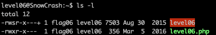
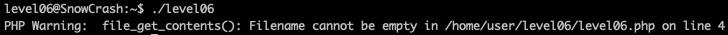
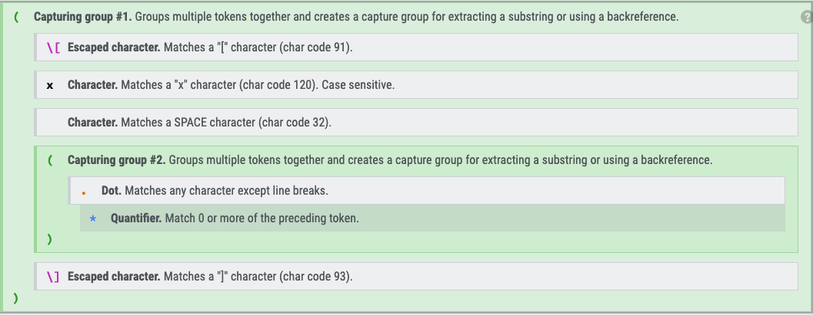
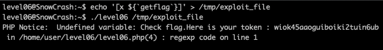

<h2>Level 06</h2>



In `level06` we found 2 files this time, an executable `level06` with `s(SUID)` permission and `level06.php`

Both files owner is `flag06` and `level06` has the `s(SUID)` permission, we could potentially run the executable as that user and exploit it into calling `getflag` for this level



`level06` is an executable which will call the `level06.php` which in turn expecting that we give it a file to read

Lets check what is the content of the `level06.php`
``` console
#!/usr/bin/php
<?php
  function y($m) {
    $m = preg_replace("/\./", " x ", $m);
    $m = preg_replace("/@/", " y", $m);
    return $m;
  }

  function x($y, $z) { 
    $a = file_get_contents($y);
    $a = preg_replace("/(\[x (.*)\])/e", "y(\"\\2\")", $a);
    $a = preg_replace("/\[/", "(", $a);
    $a = preg_replace("/\]/", ")", $a);
    return $a;
  }

  $r = x($argv[1], $argv[2]);
  print $r;
?>
```
The vulnerability happens on this line  `$a = preg_replace("/(\[x (.*)\])/e", "y(\"\\2\")", $a)`

`/e` modifier in php preg_replace allows the execution of the php code defined in the `replacement` variable of the function.

In this line, we see the `replacement` is `"y(\"\\2\")"`, if we clean up the escape character, it will be read as `y(\2)`

`y()` is a function that was defined above, and `\2` means the 2nd capturing group of the regex pattern



Base on the rule of the regex pattern, we can provided a string that align to this rule, and get our 2nd capturing group to be print out at the end of that php file

We will create a file contains this string ``[x ${`getflag`}]``, the 2nd capturing group will get the ``${`getflag`}`` out from the initial string

In php, ``${`a`}`` is the same as `$a` which means the variable `a`, and php `echo` works the same as the normal shell command `echo` as well,

So potentially, if we purposely cause an error on undefined variable, php will try to let us know which variable are the one that is reponsible by `echo` it

``${`getflag`}`` will cause an undefined variable error, as there is no `` `getflag` `` variable inside that php file.

Through php error management, it will try to do ``echo "PHP Notice:  Undefined variable: `getflag` on line xx"``

Since we know that placing a backtick between a string during an echo will cause it become an shell executable, this error message could potentially help us run the `getflag` command!

Lets try it!



Now, we have got the flag06 token as well!!  :partying_face: :tada: :tada: :tada:
