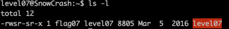
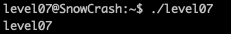
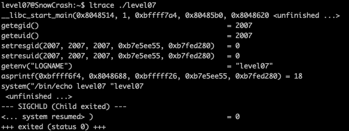
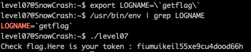

<h2>Level 07</h2>

We have a file called `level07` here and it looks like an executable.

Like most of the previous level, this file has `s` permission and `flag07` as owner, ready for us to exploit it once again~

Lets check what it does.

It seems that it is echo out its own executable name, but lets check with `ltrace` to be sure

We can see that there is `getenv("LOGNAME)` with the return value of `level07` and below it, there is an `echo` command which was using that value.

This is quite similar to the subject is `level03`, so we could try to change the `LOGNAME` env variable to `` `getflag` ``, we could potentially exploit it

Another level passed!  :partying_face: :tada: :tada: :tada:
