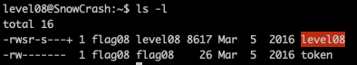
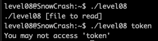
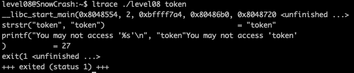
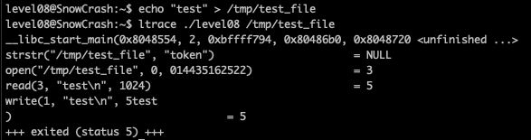
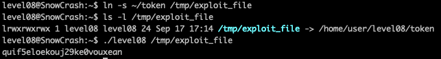
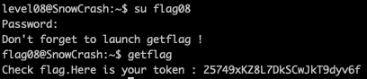

<h2>Level 08</h2>

In this level, we have the executable `level08` which is same as usual, `s(SUID)` permission and `flag08` as owner

There is also a `token` file which we have no permission to run `cat` or even `file` to check it.

Running the `level08` executable, it will prompt us to use a file to read, and when we try to run it with the `token` file, it is said that we can't access the `token`

With `ltrace` we can see that it is using the `strstr` function to check if the `token` is a substring of `token` and the result is definetly true.

Then in the next line, we see there is the `printf` which gave us the message earlier

Here we create a test file `echo "test" > /tmp/test_file` and run the executable again and analyze with `ltrace`

It seems that in the `strstr` function, 1st params is the path of the file, and the 2nd params is the string `token`

Since the `strstr` return NULL, the program did not do the `printf`, but instead it open the file and read the content and write it to stdout

If we could find a way to change the `token` file name into something else, we could potentially use that executable to read the file content!

But the `token` file has a very limited permission, so lets try to create `Symbolic Links` to this file.

With this we are able to trick the `strstr` and the token file is being read!

But this does not seems like the usual flag token, as using `quif5eloekouj29ke0vouxean` does not allow us to connect to level09 via ssh

So this could be the password for `flag08` user instead

It seems what we got from the `token` file was the password for `flag08` and then we can call the `getflag` and gain the token for the next level~
:partying_face: :tada: :tada: :tada:
