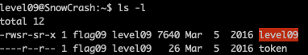
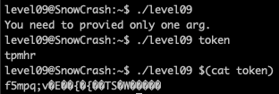
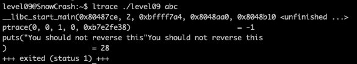
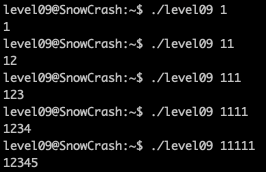
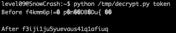
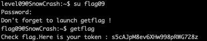

<h2>Level 09</h2>



We have 2 files a well this time, the `level09` executable with `s(SUID)` permission and `flag09` owner and a `token` file which return unreadable text



`level09` request only 1 arg, if we use the `token` file as the the arg, it seems that it used it as a direct string and convert it into something else

While if we do the `./level09 $(cat token)` which the program will take the content of the `token` file and turn it into something different as well



It seems that `ltrace` won't do much help this time, as the executable is protected with `ptrace` which prevent us to analyze it

But it do provide a clue `"You should not reverse this`, does this means that we should not hack the `ptrace` or we should not `reverse` the convert that the program did?

Lets try the `level09` executable with a few more string 



From this, we can see that the `level09` is trying some `rot` cipher, but the 1st character always remain unchanged

The subsequence character seems to move in the ASCII order base on the index they are currently in, example
```console
string = 111
string[0] = 1 + 0 = 1
string[1] = 1 + 1 = 2
string[2] = 1 + 2 = 3
```

Since this executable is moving the character forward, and its hints to `not reverse this`

We could try the opposite which to try to move the character backward

Let download the file and write some script to reverse it
```console
scp -P 4242 level09@[Machine_IP]:/home/user/level09/token [dest_path]
```

Now time to write a python script to test it
```console
import sys

text = open(sys.argv[1]).readlines()[0]
result = ""
print("Before {}".format(text))
for i in range(0, len(text) - 1):
    result = result + chr(ord(text[i]) - i)
print("After {}".format(result))
```

`ord()` return an integer representing the Unicode of the character passed into it so we could apply the `- i` operation

Since the result is an integer, we need to convert it back with `chr()`



We get the result `f3iji1ju5yuevaus41q1afiuq` this does not work as the token result of `getflag` so it could be the password for `su flag09`



Finally! We have the last flag for the compulsary exercise! Let's move on to the bonus exercise :partying_face: :tada: :tada: :tada:


