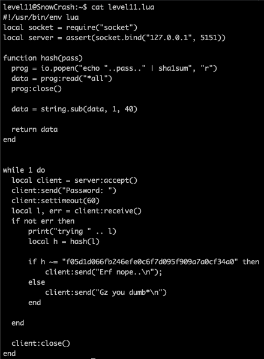

<h2>Level 11</h2>


We have `level11.lua` this time with the `s` permissions like most of the previous level, lets check the content of this file



Base on the code, we can see that it is trying to create something like a server in the `127.0.0.1` with port `5151`

Inside the while loop. we can see something that is capturing the client input and store it inside variable `l`

The program then will run a function `hash()` on the variable `l` to check if the input is the same as `f05d1d066fb246efe0c6f7d095f909a7a0cf34a0`

Either the result is true or false, it doesn't looks interesting cause it only send back string of message like `Erf nope..\n` or `Gz you dumb*\n`

Something that looks interesting will be inside the function `hash()`, we can see our familiar `echo` command inside this function, lets research further on what `io.popen` is doing.
```console
io.popen() execute the system's command and starts the program in a separate process and returns a file handle that you can use to read data from this program.

source: https://www.tutorialspoint.com/io-popen-function-in-lua-programming
```

It seems that `io.popen` is executing a system's command inside its own shell, thats why the result of the echo does not shows up in our shell.

Lets try this hypothesis!


It seems that the program is already running, lets try to use `netcat` to connect to the server


It seems that our hypothesis is correct, we can use the echo inside the `level11.lua` like how we usually does.


There we go! We have successfully received our flag for next level! This is quite an easy level :partying_face: :tada: :tada: :tada:

<h2>*SPOILER*</h2>

Actually if we use the password that we got from level10 `woupa2yuojeeaaed06riuj63c` to su flag11, it could work as well!


Well, we found another exploit in this level
