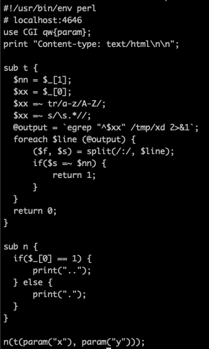

<h2>Level 12</h2>


In this level, we have `level12.pl` a perl script like back in level04 with `s` permission as well, lets check the file



Base on our knowledge back in level04, we can see that the script is trying to process `param("x")` with the subroutine `t`

Lets analyze this subroutine

```console
sub t {
  $nn = $_[1];                                get the second arg which is param("y")
  $xx = $_[0];                                get the first arg which is param("x")
  $xx =~ tr/a-z/A-Z/;                         tr will translate the a-z to A-Z which mean it will string into uppercase
  $xx =~ s/\s.*//;                            s is substitution with \s which means all whitespace, while .* will match all occurance, the result will me empty char since there is nothing between (//)
  @output = `egrep "^$xx" /tmp/xd 2>&1`;      this line is using a backtick (`) which normally will run this as a system command, it seems that we could exploit this
  foreach $line (@output) {
      ($f, $s) = split(/:/, $line);
      if($s =~ $nn) {
          return 1;
      }
  }
  return 0;
}

source:
https://www.geeksforgeeks.org/perl-substitution-operator/
https://www.geeksforgeeks.org/perl-tr-operator/
https://perldoc.perl.org/perlre
```


Base on the example above, if we could give the program `` `/bin/getflag` `` as the `param("x")` we could potentially run the getflag as user `flag12` like what we did back in level04

But since the `param("x")` is going through uppercase translate, `` `/bin/getflag` `` will become `` `/BIN/GETFLAG` `` and system command is case sensitive


We could create a file which run the getflag and echo the result into another file, and name this file in full uppercase like the example above

But we have another problem because `/tmp/GETFLAG` will be translated to `/TMP/GETFLAG`

Since we dont have the permission to create neither a new folder or file in to root `/` directory, we need another way to bypass the `/tmp` path

We could use a wildcard `*` in the path and the system will try to find the file for us.


With this, the `/*/GETFLAG` will not be affected by neither the uppercase translate nor the substitution and the path will remain the same

Now lets give `` `/*/GETFLAG` `` as the `param("x")` for the program with `curl`


And here we go! We got the flag thanks to the knowledge base in level04  :partying_face: :tada: :tada: :tada:


