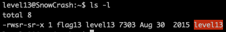
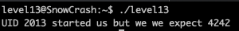
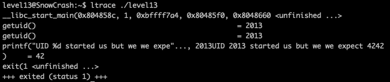
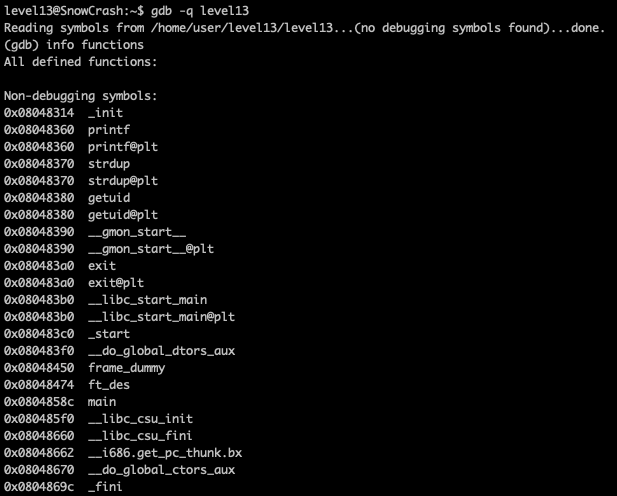
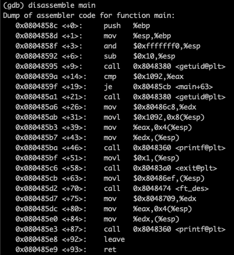
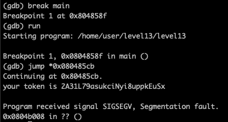

<h2>Level 13</h2>



We have another executable with `s(SUID)` permission again this time, lets check what it does



The program said that UID `2013` started it, but they expect UID `4242`

If we use the `id` command, we can see that current user `level13` is having an UID of `2013` which means the program is using something like `getuid()`

But who is UID `4242`?

Back in exercise `level01` we encounter the file `/etc/passwd` which contain the list of all user in the system.

We can do `cat /etc/passwd | grep 4242` to see which user is having this UID, but unfortunately there is no such user in this system

With this we can assume that UID `4242` is hard coded into the program and this user does not exist in this system.

Lets do an `ltrace` to check the executable



This looks very similar to what we encounter back in `level03`, but there is no `echo` or any other system command to exploit, this could be a really hard level

With this link back in level03 exercise `https://opensource.com/article/20/4/linux-binary-analysis`

We can see the final way to analyze a binary is using `gdb (GNU debugger)` which could allow us to debug during the program runtime



First we use `gdb -q level13` (-q for quiet) to start the debugging of the executable, and next we use `info functions` to see the list of the functions inside this executable

Since we does not have the source code, we can use the `disassemble (function name)` to analyze the code in its assembly form



In this assembly code we can see that at line 9, the program is calling the `getuid()` and the next line it is doing `cmp    $0x1092,%eax`, followed by `je     0x80485cb <main+63>`

Base on Intel’s calling convention, the return value of a function call is stored in the EAX, so we can see that the program is using `cmp` to compares the value in the address `0x1092` vs `eax`

`je` is a conditional jumps if the preceding command is `true`, in this program it will jump straight to `main+63` which is line 63

Base on all this analysis, we can conclude that line 14 is were the program is checking if we have the UID 4242 and if yes we can skip to line 63

What if we can just skip the whole code and go to line 63 to start the code from that point instead?



First we set a break point at the start of the function with `break main` then we `run` the program

It will run up to the breakpoint that we have set, which is the start of the `main()`

The we can use the `jump (*address)` command to continue the program in the address that we want, and here we give the address of line 63

Here we go! The program continue from that address onward and give us the token  :partying_face: :tada: :tada: :tada:


<h2>*UPDATE*</h2>

After solving the `level14` exercise, it seems that we could modify the return of the `getuid()` with a `set ($eax) = 4242`

That will be another to solve this exercise as well instead of using `jump`


```console
Useful link:
https://stackoverflow.com/questions/5125896/how-to-disassemble-a-binary-executable-in-linux-to-get-the-assembly-code
https://perspectiverisk.com/intro-to-basic-disassembly-reverse-engineering/
https://expobrain.net/2013/06/16/disassembly-c-code-for-fun-part-1/
https://www.cs.uaf.edu/2015/fall/cs301/lecture/09_11_loops.html
https://ftp.gnu.org/old-gnu/Manuals/gdb/html_node/gdb_112.html
https://users.ece.utexas.edu/~adnan/gdb-refcard.pdf
```

