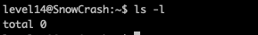
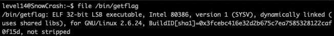
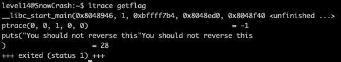
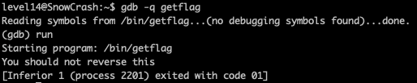
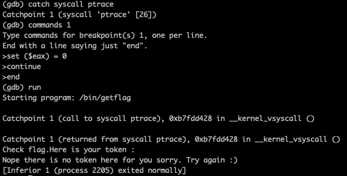
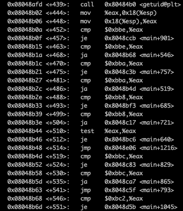
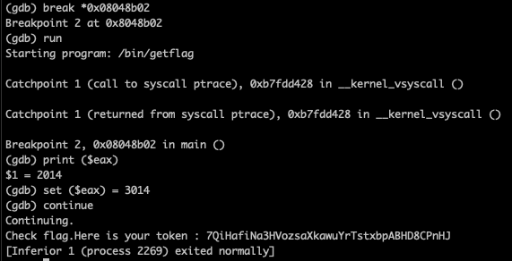
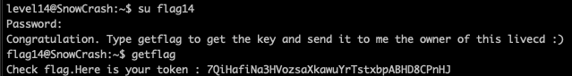

<h2>Level 14</h2>



Here at the final level, there is no file nor anything that we could exploit on.

Since this is the last level and base on the knowledge that we learn from all the previous level, why not we try to exploit the main boss `getflag` ?

This should be a very fitting place to exploit this program now, lets do some analysis



It seems that `getflag` is an `ELF 32-bit LSB executable` as well, which means that `ltrace` and `gdb` could be use to analysis it





It is protected by `ptrace` like back in `level09`, but we didn't try to reverse the `ptrace` back then since we don't really need to

But now lets find if there is a way to bypass the `ptrace`
```console
https://stackoverflow.com/questions/33646927/bypassing-ptrace-in-gdb
```

There is someone in this link that show us how to bypass the `ptrace` when we debug the program using `gdb`

Lets try it!



It works! Now lets try to dissamble the main function to analyze its assembly form



`getflag` is surprisingly long with 1400+ lines!

There is only 1 call of `getuid` but there is alot of `cmp` and `je` command, which makes sense since this executable have being delivering us alot of tokens depending on the `flag` level that we were at

We could use `jump` to address like the previous level, but it seems to be very tedious since there is alot of address that could be the right one for `flag14`

Since we learned that we could do a `set ($eax)` and we know that `$eax` is where the function return value is saved

We can set a breakpoint at the next line right after the program calls `getuid` so we could replace the `$eax` value to anything we want to

Base on the `/env/passwd` file, we can see that `flag14` has and UID of `3014` so we should set that as the `$eax` value and let the program bring us to the token



It seems that it gave us a token that we never received before `7QiHafiNa3HVozsaXkawuYrTstxbpABHD8CPnHJ`

Lets try to use it as a password for `flag14` and see what happens



And here we are!! We have manage to pass all the level in this project!!  :partying_face: :tada: :tada: :tada:
